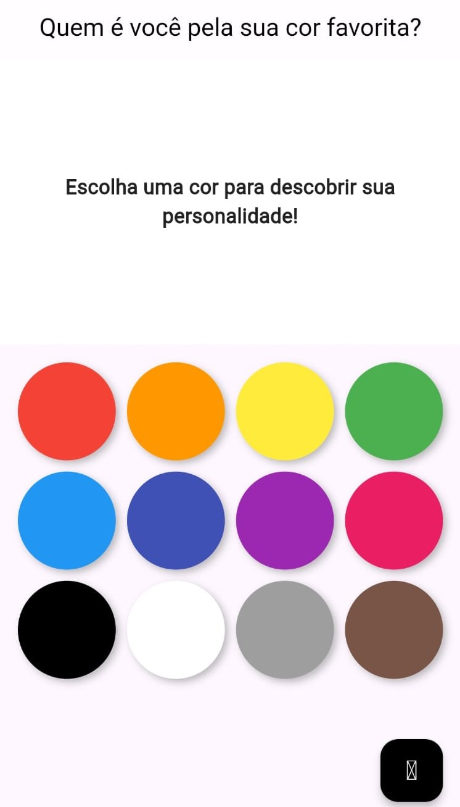

# Cor Favorita App 🟥🟧🟨🟩🟦🟪
Este é um aplicativo desenvolido em Flutter que apresenta uma paleta de cores para você escolher a sua favorita. Ao clicar em uma cor, você receberá uma mensagem personalizada explicando o que essa cor representa.  

Clique [`aqui`](https://avrilstihler.github.io/cor-favorita-app/) para acessar a página web do app.

## Desenvolvimento  

- O projeto foi criado usando **Flutter**.  
- Foi exportado para web e hospedado no **GitHub Pages** para acesso fácil e direto no navegador.  

**Nota**: O ícone do botão `reset` não carregou corretamente durante a exportação para web, o que pode alterar o visual final. No entanto, todas as funcionalidades estão funcionando normalmente.  

