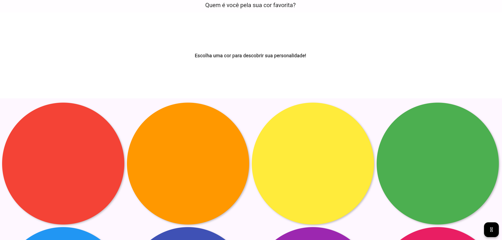

# Cor Favorita App 🎨 

Cor Favorita é um aplicativo Web desenvolvido em **Flutter** (Dart) que permite escolher uma cor em uma **paleta interativa**. Ao selecionar sua cor favorita, o app exibe uma mensagem personalizada sobre você!  

## 🖼️ Preview do App  
  

🔗 **Acesse o Cor Favorita**  [Clique aqui para usar o app!](https://avrilstihler.github.io/cor-favorita/)  

## Funcionalidades  
🔴 **Paleta de cores interativa** para seleção.

🟡 **Mensagem personalizada** baseada na cor escolhida.

🟢 **Botão de reset** para reiniciar.

🔵 **Design responsivo**, adaptado para celulares e desktops.  

## Problema na versão Web  
Ao exportar o app para a Web, ocorreu um erro que impediu o ícone do botão de reset de aparecer. Isso prejudica a experiência visual, mas não afeta o funcionamento do botão.  

